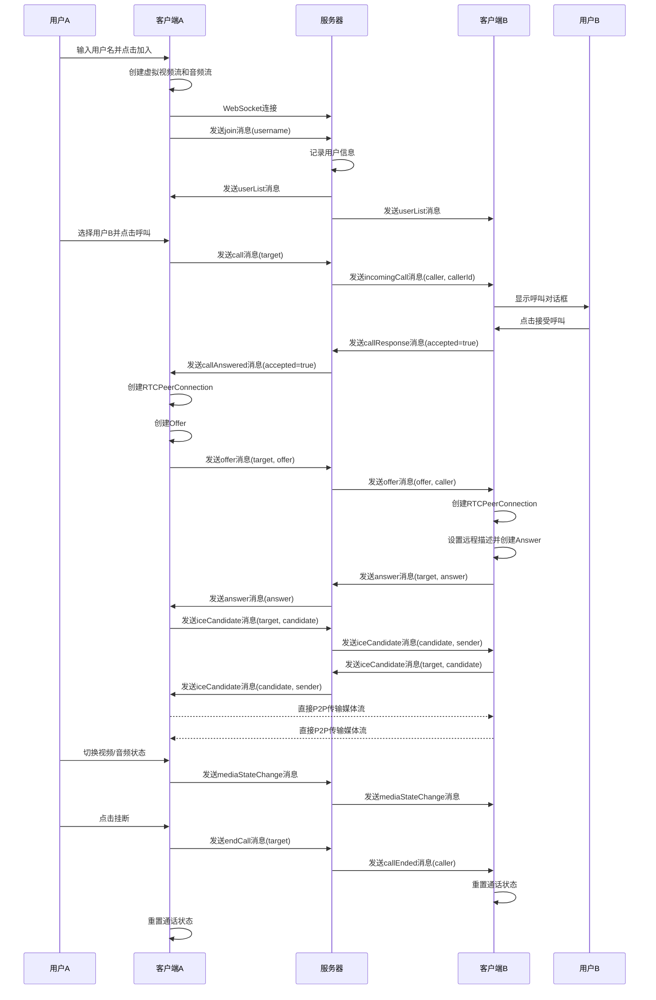
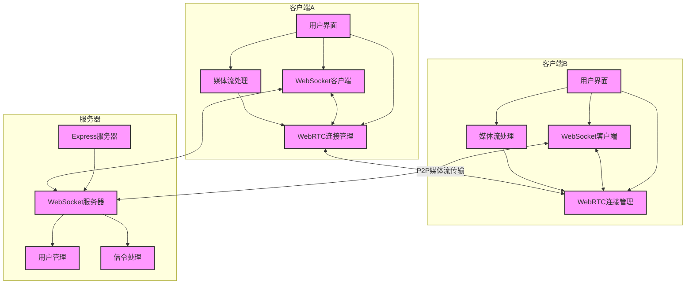

# WebSocket版本WebRTC视频通话实现分析

## 功能流程图

## 架构图

## 系统组件说明

### 客户端组件

1. **用户界面**
   - 登录界面：用户输入用户名并加入
   - 聊天界面：显示在线用户列表、视频区域和控制按钮
   - 呼叫对话框：显示来电信息，提供接受/拒绝选项

2. **WebSocket客户端**
   - 负责与服务器建立WebSocket连接
   - 发送和接收信令消息
   - 处理连接断开和重连

3. **媒体流处理**
   - 创建虚拟视频流（Canvas动画）
   - 获取音频流（麦克风）
   - 管理媒体流的开启/关闭状态

4. **WebRTC连接管理**
   - 创建和管理RTCPeerConnection
   - 处理ICE候选
   - 创建和处理Offer/Answer
   - 管理媒体轨道

### 服务器组件

1. **Express服务器**
   - 提供静态文件服务
   - 处理HTTP请求

2. **WebSocket服务器**
   - 管理WebSocket连接
   - 处理消息的接收和转发

3. **用户管理**
   - 维护在线用户列表
   - 管理用户ID和连接关系

4. **信令处理**
   - 处理各类信令消息（join、call、offer、answer等）
   - 转发信令消息到目标用户

## 信令消息类型

1. **join**: 用户加入聊天
2. **userList**: 在线用户列表更新
3. **call**: 发起呼叫请求
4. **incomingCall**: 收到呼叫请求
5. **callResponse**: 呼叫应答（接受/拒绝）
6. **callAnswered**: 呼叫应答结果
7. **offer**: WebRTC连接offer
8. **answer**: WebRTC连接answer
9. **iceCandidate**: ICE候选信息
10. **mediaStateChange**: 媒体状态变化（视频/音频开关）
11. **endCall**: 结束通话请求
12. **callEnded**: 通话已结束通知

## WebSocket vs Socket.io 实现对比

本项目同时提供了WebSocket和Socket.io两种实现版本，主要区别如下：

1. **API差异**
   - WebSocket版本使用原生WebSocket API（ws模块）
   - Socket.io版本使用Socket.io库提供的API

2. **连接建立**
   - WebSocket版本需要手动处理连接URL构建和重连
   - Socket.io自动处理连接细节和重连

3. **消息格式**
   - WebSocket版本需要手动序列化/反序列化JSON消息
   - Socket.io自动处理消息序列化

4. **事件处理**
   - WebSocket版本使用onmessage统一接收消息，然后根据类型分发
   - Socket.io使用事件名称直接注册处理函数

5. **房间和命名空间**
   - WebSocket版本需要手动实现用户分组
   - Socket.io提供内置的房间和命名空间功能

两种实现在功能上完全等价，但Socket.io版本代码结构更清晰，而WebSocket版本更接近底层实现。